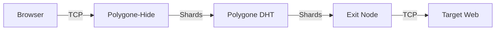

# 🛡️ Polygone-Hide

**The Vapor Tunnel: Post-Quantum SOCKS5 Privacy.**

Polygone-Hide is a zero-knowledge networking tunnel that fragments your TCP traffic across the Polygone ephemeral network. Unlike a traditional VPN, your connection is "vaporized" into multiple shards, making metadata analysis nearly impossible.

## 🚀 How it works

1. **Capture**: Accepts local SOCKS5 connections (Browser, SSH, etc.).
2. **Sharding**: Every packet is split using Shamir Secret Sharing.
3. **Drift**: Fragments travel through different DHT paths.
4. **Reconstruct**: Exit nodes reconstruct and execute requests, sharding responses back.

## 🛡️ Metadata Invisibility

Traditional VPNs hide your IP but have a centralized point of failure. Polygone-Hide ensures:
- **No Path Association**: Fragments of a single request travel through different peers.
- **No Traffic Correlation**: Packet timing is obfuscated by the DHT's natural jitter.

## 🛠️ Usage

### Start the Tunnel
```bash
polygone-hide start --port 1080
```

### Use with Browser (Firefox/Chrome)
Configure your browser to use a **SOCKS5 Proxy** at `127.0.0.1:1080`.

### Use with CLI
```bash
curl --proxy socks5h://127.0.0.1:1080 https://checkip.amazonaws.com
```

## 🏗️ Architecture



## ⚖️ License
MIT License - 2026 Lévy / Polygone Ecosystem.
